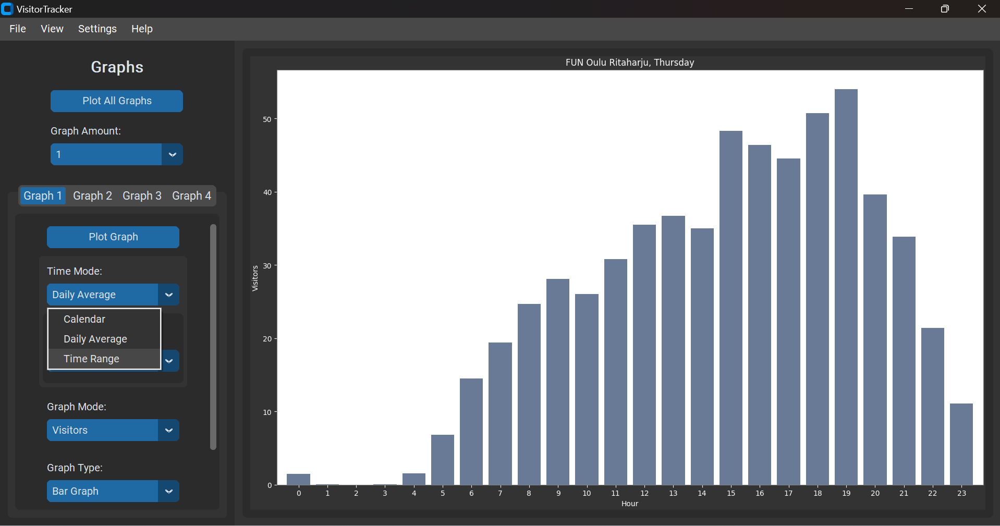

# Draw graph from collected data

Collects data from a gym's website about how many visitors are at the gym at any given time. Draws different graphs from the data.

# About

KORJAA!(name here) is a Tkinter based GUI application that scrapes visitor data from a local gym's website, stores that data in a SQLite database, and draws different graphs from the collected data. This project was created as a hobby project to draw some interesting graphs and to gain some more coding experience.

KORJAA!-app was designed to be compatible with multiple sources of data. Adding more data collection locations should be quite simple, requiring only to implement data scraping from a new website and adding a new option to the GUI for selecting which location to collect the data from. (I might choose to add more locations in the future if I regain my interest in this project again.)

# How to use - Demo

Example usage of the application.

**Starting screen.**

**Open the calendar by pressing the "Open Calendar"- button.** The dates in the calendar that are highlighted by green background signify dates with data collected and dates without the green background don't have any collected data.

**Plot a graph by pressing "Plot All Graphs"-button or "Plot Graph"-button.** "Plot all graphs"-button will plot all graphs shown on screen (the amount of graphs depends on the selected Graph Amount: 1, 2 or 4). "Plot Graph"-button only plots its connected graph. The "Plot Graph"-button is disabled in all tabs exceeding the graph amount. (For example, if graph amount is set to 1 and user selects Graph 2,3 or 4 the "Plot Graph" button for those tabs will be disabled.)

**Select graph mode. Most Visitors in this case.**

****

