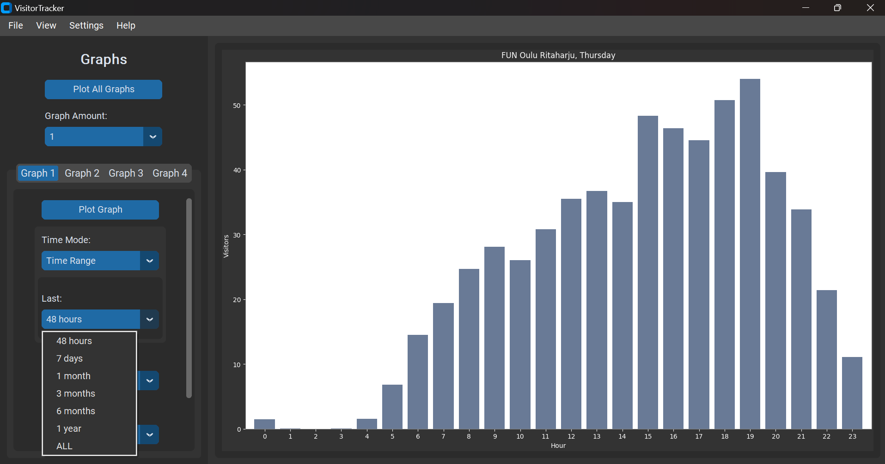
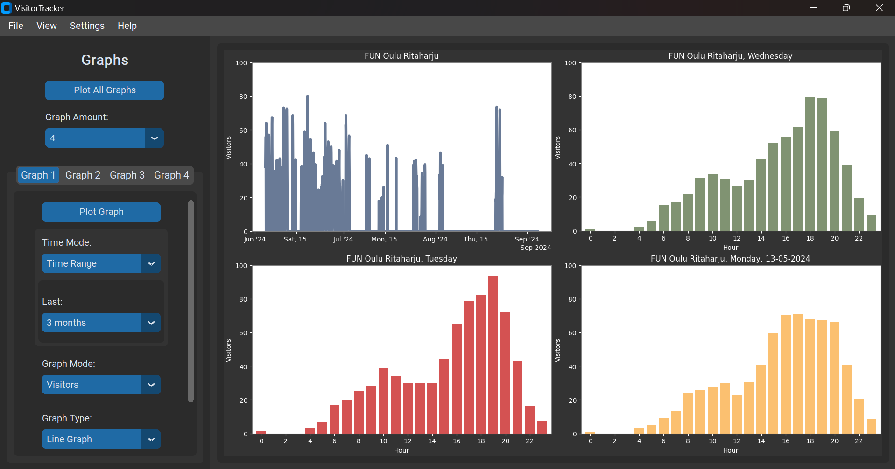

# VisitorTracker

# About
VisitorTracker is a Tkinter based GUI application that scrapes visitor data from a local gym's website, stores that data in a SQLite database, and draws different graphs from the collected data. This project was created as a hobby project to draw some interesting graphs and to gain some more coding experience.

VisitorTracker was designed to be compatible with multiple sources of data. Adding more data collection locations should be quite simple, requiring only to implement data scraping from a new website and adding a new option to the GUI for selecting which location to collect the data from. (I might choose to add more locations in the future if I regain my interest in this project again.)

# How to use - Demo

Example usage of the application.

**Opening screen**

**Use the 'Open Calendar' button to access the calendar**\
Dates with a green background indicate collected data, while non-highlighted dates have no data.

**Use the 'Plot All Graphs' or 'Plot Graph' button to plot a graph**\
The number of graphs plotted by 'Plot All Graphs' depends on the selected 'Graph Amount' (e.g., if set to 2, only graphs 1 and 2 will be plotted). The 'Graph Amount' can be set to 1, 2, or 4.\
The 'Plot Graph' button plots only its specific graph and is disabled for tabs beyond the set 'Graph Amount' (e.g., if graph amount is set to 1, the 'Plot Graph' button for Graphs 2, 3, and 4 will be disabled).

**Select a graph mode, such as 'Most Visitors'**\
There are three graph modes: 'Visitors' calculates the average number of visitors for each hour, 'Most Visitors' selects the highest value for each hour, and 'Least Visitors' selects the lowest value for each hour. (Each hour may have multiple visitor readings if data was collected several times within that hour)

**Plotted 'Most Visitors' graph**

**Select a new Graph Amount**

**4 different graphs plotted with 'Plot All Graphs' button**

The graph numbers in the tabs correspond to this diagram:\

**2 plotted graphs**

**Select a graph type, such as 'Line Graph'**

**Plotted Line Graph**

**Location selection**\
Multiple locations have not been implemented yet. New locations might be added in the future.

**Select a time mode, such as 'Daily Average'**\
There are three time modes: 'Calendar' allows selection of a specific date, 'Daily Average' averages visitors by day of the week, and 'Time Range' allows selection of a period from the present back to various intervals, such as 48 hours, 7 days, 1 month, and so forth.

**Plotted 'Daily Average' graph (Monday)**

**Plotted 'Daily Average' graph (Thursday)**

**Selecting 'Time Range' as the time mode**

**Plotted 'Time Range' graph (activity of last 3 months)**

## Menubar

**Select 'Save Single Graph' from the 'File' dropdown**\
'Save Figure' option saves all displayed graphs as a single image. 'Save Single Graph' option opens a popup for selecting which graph to save as an image.

'Import Data' option opens the file manager to select another database (\*.db) and merges its visitor data with the current database. Initially created for debugging but I decided to keep it, can be useful for combining data from multiple devices if needed. 'Create Backup'-option creates a copy of the database file (\*.db). 'Change Database'-option lets user change the database that is used. 'Create Backup' and 'Change Database' were also both created for debugging but I decided to keep them even though they might not have that many use cases.

**Select the number of the graph that you wish to save and press 'OK'**\
(The 'OK' button is hidden behind the graph number options in this picture)

## Database View

**Select 'Database' from the 'View' dropdown**\
'Graphs' option and 'Database' option open their respective pages.

**Select the 'Data Collection Interval', such as 30 seconds**\
All changes made in the database page will show in the 'Database events' sidebar.

**Start data collection**\
Data collection continues in the background until it is stopped or the application is closed.

**Stop data collection**

**Select a different data collection interval and start collecting data**

**Collected data**

## Settings

**Open 'Settings'**

**Settings popup**\
Clicking the current database name opens a file manager to select a new database. 'Use Default Database' reverts it back to the default database.\
There are three 'Y-axis upper limit'-modes: 'Auto Limit' adjusts the upper limit across all graphs based on the highest value when a new graph is drawn, 'No Limit' lets each graph set its own upper limit, and 'Select Limit' allows user to set a fixed upper limit for all graphs.\
'Reset' restores all settings to their defaults, 'OK' saves any changes, and 'Cancel' discards them.

**Different upper limit options**

**Save changes by clicking 'OK'**

**4 graphs with Auto Limit**

**4 graphs with No Limit**

**Select Limit**

**100 as the upper limit**

**Save changes**

**4 graphs No Limit**

**4 graphs Select Limit (100)**

